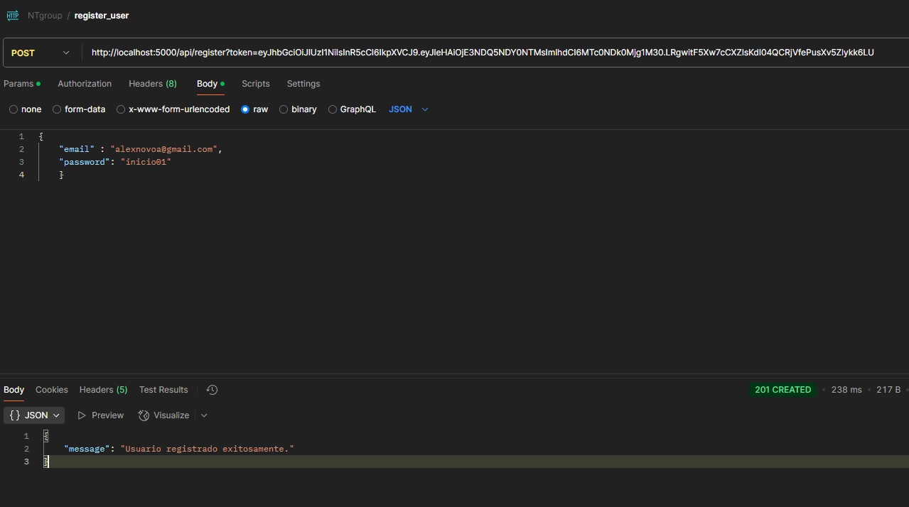
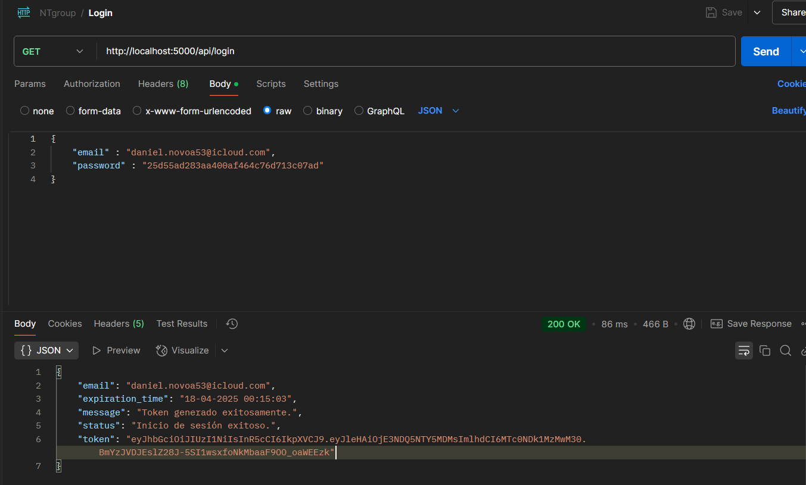
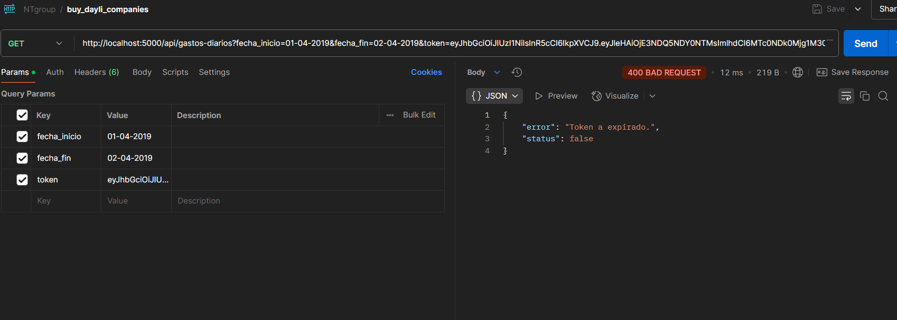
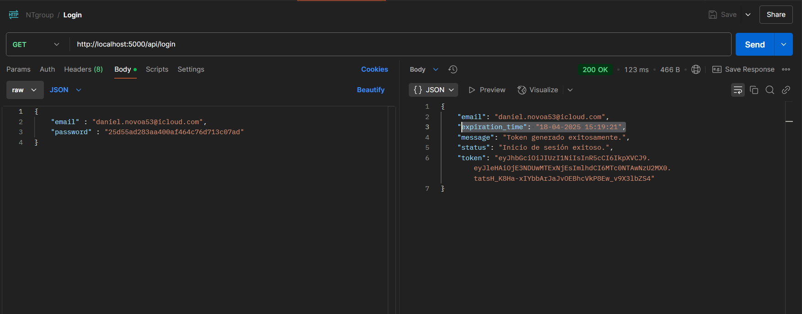
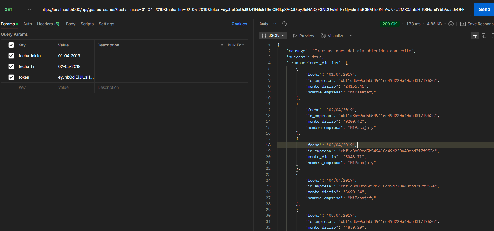
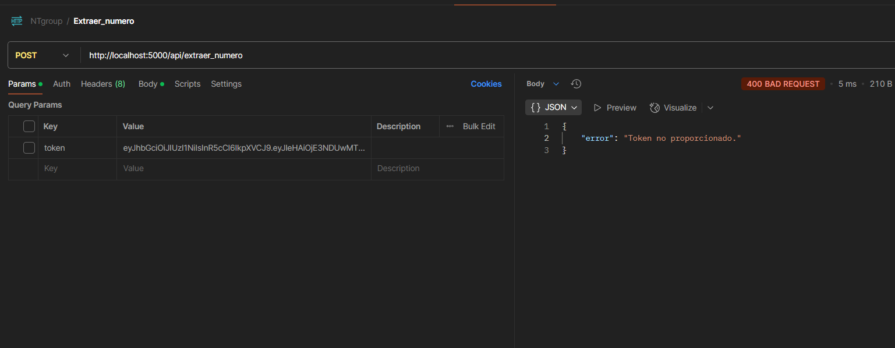
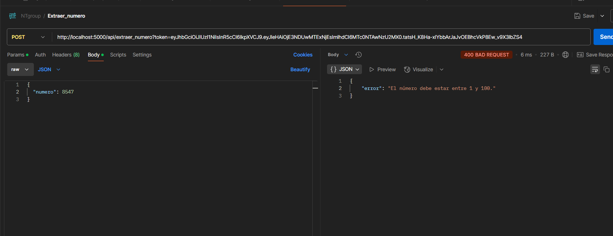
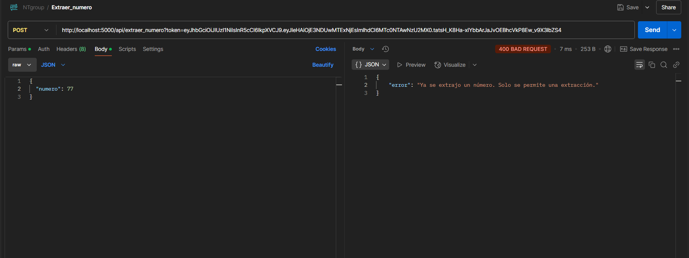
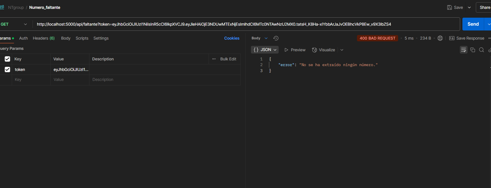

## Proceso ETL Parte 1: Extracción y Transformación

El proyecto implementa un pipeline ETL (Extracción, Transformación y Carga) automatizado utilizando Python y Pandas,
orientado al procesamiento de archivos CSV crudos con datos de compras de múltiples empresas. Los datos transformados se
almacenan en una base de datos PostgreSQL. El objetivo principal es generar una vista SQL que consolide las transacciones
diarias por empresa. Esta vista es consumida tanto por una API REST como por un proceso que genera un archivo CSV con
el resumen diario de transacciones por compañía.


# Ventajas de usar PostgreSQL en un proceso ETL con Python

- Eficiencia con grandes volúmenes de datos: Ideal para manejar y transformar grandes datasets.
- Consultas avanzadas: Permite agregaciones, uniones y sub consultas directamente en la base de datos.
- Escalabilidad: Perfecto para procesos ETL que crecen con el tiempo.
- Integración con Python: Se conecta fácilmente mediante `psycopg2` o `SQLAlchemy`.


## Elección de herramientas: ¿Por qué Python, pandas y CSV?

### ¿Por qué Python?
Python fue elegido como lenguaje principal por su simplicidad, legibilidad y la amplia comunidad de soporte en tareas de
procesamiento de datos. Además, cuenta con un ecosistema maduro de librerías especializadas en ciencia de datos, lo que
lo convierte en una opción natural para proyectos ETL.

### ¿Por qué pandas?
La librería `pandas` es una herramienta poderosa para el análisis y manipulación de datos estructurados. Algunas de las 
razones clave para su uso en este proyecto son:

- Permite leer archivos CSV de forma eficiente, incluso cuando hay miles de registros.
- Ofrece funcionalidades integradas para limpiar, transformar y agrupar datos.
- Soporta fácilmente la conversión entre distintos tipos de datos (fechas, strings, números).
- Su integración con otras librerías (como `sqlalchemy` y `psycopg2`) facilita la carga en bases de datos.

### ¿Por qué el formato CSV?
El formato CSV fue utilizado porque los datos proporcionados originalmente venían en este formato. Además:

- Es un formato ampliamente compatible y fácil de manipular.
- Puede abrirse y revisarse con herramientas simples como Excel o Google Sheets.
- Es ideal para flujos de datos en proyectos ETL de pequeña y mediana escala.

El uso de Python + pandas + CSV permite un flujo de procesamiento flexible, replicable y fácil de mantener.

### Extracción
Los archivos de entrada están ubicados en el directorio `dataset_in/compras.csv/` y contienen información en formato `.csv`. 
Estos archivos son leídos usando `pandas`, lo que permite una lectura eficiente y flexible de datos tabulares.

### Transformación
El script `scripts/transform_data.py` se encarga de aplicar transformaciones a los datos extraídos. Entre las tareas de 
transformación realizadas se incluyen:

- Normalización y limpieza de columnas (eliminación de espacios, corrección de tipos).
- Conversión de fechas y números a formatos estandarizados.
- Unificación de estructuras de datos entre archivos para facilitar su integración.
- Generación de archivos transformados en `dataset_out/chrages.csv, companies.csv, trasacciones_dias.csv, traza_registro.csv/`.

Estas transformaciones se realizan para asegurar la calidad, consistencia y usabilidad de los datos.

# Transformación de dataset
El script `scripts/transform.py` se encarga de realizar las transformaciones necesarias en los archivos de entrada, lee
un archivo de entrada en formato csv llamado compras.csv y realiza las siguientes transformaciones:

### Descripción del script de Transformación de Datos y problemas resueltos

Este script en Python realiza una transformación de datos en un archivo CSV de compras. A continuación, se describe cada paso realizado:

1. **Lectura del archivo CSV**:
   - El archivo `compras.csv` es leído desde la carpeta `dataset_in` utilizando `pandas`.

2. **Normalización de nombres de columnas**:
   - Se eliminan los espacios extra y se convierten a minúsculas los nombres de las columnas.

3. **Reemplazo de espacios vacíos por `NaN`**:
   - Se reemplazan las celdas vacías (espacios) por valores `NaN`.

4. **Creación de columna de trazabilidad**:
   - Se agrega una columna llamada `acciones` para registrar los cambios realizados.

5. **Validación e imputación de `company_id`**:
   - Se valida que él `company_id` sea alfanumérico y tenga 10 o más caracteres.
   - Si un `company_id` es inválido y hay un valor en `name`, se intenta imputar el `company_id` de otro registro con el mismo nombre.

6. **Imputación de `name` si falta y company_id**:
   - Si él `name` está vacío, pero hay un `company_id`, se intenta imputar el `name` de otro registro con el mismo `company_id`
   y viceversa.

7. **Validación de campos requeridos**:
   - Se asegura que las columnas `id`, `company_id`, `created_at`, `amount`, `status`, y `name` no contengan valores nulos.
   Si falta algún dato, se marca como "nulo" y se registra la acción.

8. **Generación de `UUID` para filas con `id` "nulo"**:
   - Si el `id` es "nulo", se genera un UUID único para esa fila.

9. **Procesamiento de la columna `paid_at`**:
   - Si falta el valor en `paid_at`, se marca como "no_pagado" en trazabilidad y se reemplaza por `None` para guardar 
   en la base de datos.

10. **Reemplazo de "nulo" por `None` en columnas de tipo fecha**:
    - Las columnas `created_at` y `paid_at` reemplazan el valor "nulo" por `None` para cumplir con los estándares de fechas.

11. **Trazabilidad**:
    - Se guarda un archivo `traza_registros.csv` con las filas que han sido modificadas.

12. **Generación de archivo `companies.csv`**:
    - Se limpia el archivo de compañías, asegurando que él `company_id` sea alfanumérico y tenga al menos 10 caracteres.
    - Se agrupan las compañías por `company_id`, tomando el valor más frecuente en `name` para cada compañía.
    - Se guarda el archivo limpio.

13. **Generación de archivo `charges.csv`**:
    - Se guarda un archivo `charges.csv` con las columnas relevantes (`id`, `company_id`, `amount`, `status`, `created_at`, `paid_at`).

14. **Manejo de errores**:
    - Se manejan errores de archivo no encontrado y otros errores inesperados.

### Archivos generados:
- `traza_registros.csv`: Registros con los cambios realizados.
- `companies.csv`: Lista de compañías limpias.
- `charges.csv`: Datos de cargos procesados.
- `trasacciones_dias.csv`: Gastos de cada dia por empresa.

# Script de Carga y Ejecución del Proceso ETL

Este archivo (`load_data.py`) es el punto de entrada principal del proceso ETL (Extracción, Transformación y Carga) de datos.

## ¿Qué hace este script?

1. **Transforma los datos crudos**:
   - Llama a `transform_data()` para limpiar, validar e imputar datos del archivo `compras.csv`.

2. **Carga los datos transformados a PostgreSQL**:
   - Inserta los datos limpios en las tablas `companies` y `charges`.
   - Evita duplicados mediante `ON CONFLICT DO NOTHING`.

3. **Exporta resultados**:
   - Llama a `export_view_to_csv()` para exportar una vista llamada `transacciones_diarias` a un archivo CSV.

# Script de Exportación de Vista: `export_view_to_csv.py`

Este script se encarga de **exportar una vista de la base de datos PostgresSQL a un archivo CSV**.

### ¿Qué hace?

1. Se conecta a la base de datos usando `connectdb()`.
2. Ejecuta una consulta sobre la vista `transacciones_diarias`.
3. Convierte el resultado a un `DataFrame` de pandas.
4. Exporta el contenido de las transacciones diarias por empresa a un archivo llamado `transacciones_diarias.csv`
5. en la carpeta `dataset_out`.

### ¿Cómo se ejecuta?

El flujo se se ha ejecutado directamente desde el IDE python Pycharm desde el icono play de la parte superior
de la ventana de Pycharm, lo que ha disparado todo el proceso de ETL de manera automática.

La finalidad de este script es **exportar la vista `transacciones_diarias` a un archivo CSV, destinado a la carpeta
`dataset_out/transacciones_diarias.csv`** alli es se encuentran donde los gastos diarios de cada empresa por día.

# Se agregó una api rest para ver las transacciones diarias por empresa donde se puede aplicar filtros por fecha.
Se usó flask para crear el servidor y se usó la libreria de flask para crear la api, la logica se encuentra en 
`app.py` y las funciones se encuentran en `utils/utils.py`.
Se ha probado en `postman` y funciona correctamente.

## Para poder usar la api se deben de hacer los siguientes pasos:
1. Se debe crear un usuario en la base de datos para poder acceder a la api.
http://localhost:5000/api/register
Pide como argumento un token de acceso, y como body el username y password.

2. Para poder generar un token de acceso se debe hacer login.
http://localhost:5000/api/login

3. Funcionamiento de validation del token al querer ver las transacciones diarias.

Hacemos login

4. Consultamos las transacciones diarias pasando las fechas que queremos y el token de acceso.
http://localhost:5000/api/gastos-diarios?fecha_inicio=01-04-2019&fecha_fin=02-05-2019

Json obtenido:
```json
{
    "message": "Transacciones del dia obtenidas con exito",
    "success": true,
    "transacciones_diarias": [
        {
            "fecha": "01/04/2019",
            "id_empresa": "cbf1c8b09cd5b549416d49d220a40cbd317f952e",
            "monto_diario": "24166.46",
            "nombre_empresa": "MiPasajefy"
        },
        {
            "fecha": "02/04/2019",
            "id_empresa": "cbf1c8b09cd5b549416d49d220a40cbd317f952e",
            "monto_diario": "9200.42",
            "nombre_empresa": "MiPasajefy"
        },
        {
            "fecha": "03/04/2019",
            "id_empresa": "cbf1c8b09cd5b549416d49d220a40cbd317f952e",
            "monto_diario": "5048.71",
            "nombre_empresa": "MiPasajefy"
        },
        {
            "fecha": "04/04/2019",
            "id_empresa": "cbf1c8b09cd5b549416d49d220a40cbd317f952e",
            "monto_diario": "6690.34",
            "nombre_empresa": "MiPasajefy"
        },
        {
            "fecha": "05/04/2019",
            "id_empresa": "cbf1c8b09cd5b549416d49d220a40cbd317f952e",
            "monto_diario": "4839.20",
            "nombre_empresa": "MiPasajefy"
        },
        {
            "fecha": "06/04/2019",
            "id_empresa": "cbf1c8b09cd5b549416d49d220a40cbd317f952e",
            "monto_diario": "4750.46",
            "nombre_empresa": "MiPasajefy"
        },
        {
            "fecha": "07/04/2019",
            "id_empresa": "cbf1c8b09cd5b549416d49d220a40cbd317f952e",
            "monto_diario": "3698.81",
            "nombre_empresa": "MiPasajefy"
        },
        {
            "fecha": "08/04/2019",
            "id_empresa": "cbf1c8b09cd5b549416d49d220a40cbd317f952e",
            "monto_diario": "2945.73",
            "nombre_empresa": "MiPasajefy"
        },
        {
            "fecha": "09/04/2019",
            "id_empresa": "cbf1c8b09cd5b549416d49d220a40cbd317f952e",
            "monto_diario": "3317.24",
            "nombre_empresa": "MiPasajefy"
        },
        {
            "fecha": "10/04/2019",
            "id_empresa": "cbf1c8b09cd5b549416d49d220a40cbd317f952e",
            "monto_diario": "3121.98",
            "nombre_empresa": "MiPasajefy"
        },
        {
            "fecha": "11/04/2019",
            "id_empresa": "cbf1c8b09cd5b549416d49d220a40cbd317f952e",
            "monto_diario": "5518.72",
            "nombre_empresa": "MiPasajefy"
        },
        {
            "fecha": "12/04/2019",
            "id_empresa": "cbf1c8b09cd5b549416d49d220a40cbd317f952e",
            "monto_diario": "5490.78",
            "nombre_empresa": "MiPasajefy"
        },
        {
            "fecha": "13/04/2019",
            "id_empresa": "cbf1c8b09cd5b549416d49d220a40cbd317f952e",
            "monto_diario": "3256.21",
            "nombre_empresa": "MiPasajefy"
        },
        {
            "fecha": "14/04/2019",
            "id_empresa": "cbf1c8b09cd5b549416d49d220a40cbd317f952e",
            "monto_diario": "3054.44",
            "nombre_empresa": "MiPasajefy"
        },
        {
            "fecha": "15/04/2019",
            "id_empresa": "cbf1c8b09cd5b549416d49d220a40cbd317f952e",
            "monto_diario": "4898.92",
            "nombre_empresa": "MiPasajefy"
        },
        {
            "fecha": "16/04/2019",
            "id_empresa": "cbf1c8b09cd5b549416d49d220a40cbd317f952e",
            "monto_diario": "16460.79",
            "nombre_empresa": "MiPasajefy"
        },
        {
            "fecha": "17/04/2019",
            "id_empresa": "8f642dc67fccf861548dfe1c761ce22f795e91f0",
            "monto_diario": "34973.00",
            "nombre_empresa": "Muebles chidos"
        },
        {
            "fecha": "17/04/2019",
            "id_empresa": "cbf1c8b09cd5b549416d49d220a40cbd317f952e",
            "monto_diario": "4140.95",
            "nombre_empresa": "MiPasajefy"
        },
        {
            "fecha": "18/04/2019",
            "id_empresa": "cbf1c8b09cd5b549416d49d220a40cbd317f952e",
            "monto_diario": "2907.59",
            "nombre_empresa": "MiPasajefy"
        },
        {
            "fecha": "19/04/2019",
            "id_empresa": "cbf1c8b09cd5b549416d49d220a40cbd317f952e",
            "monto_diario": "1709.30",
            "nombre_empresa": "MiPasajefy"
        },
        {
            "fecha": "20/04/2019",
            "id_empresa": "cbf1c8b09cd5b549416d49d220a40cbd317f952e",
            "monto_diario": "1397.58",
            "nombre_empresa": "MiPasajefy"
        },
        {
            "fecha": "21/04/2019",
            "id_empresa": "cbf1c8b09cd5b549416d49d220a40cbd317f952e",
            "monto_diario": "2367.39",
            "nombre_empresa": "MiPasajefy"
        },
        {
            "fecha": "22/04/2019",
            "id_empresa": "cbf1c8b09cd5b549416d49d220a40cbd317f952e",
            "monto_diario": "3081.56",
            "nombre_empresa": "MiPasajefy"
        },
        {
            "fecha": "23/04/2019",
            "id_empresa": "cbf1c8b09cd5b549416d49d220a40cbd317f952e",
            "monto_diario": "2384.47",
            "nombre_empresa": "MiPasajefy"
        },
        {
            "fecha": "24/04/2019",
            "id_empresa": "cbf1c8b09cd5b549416d49d220a40cbd317f952e",
            "monto_diario": "3476.73",
            "nombre_empresa": "MiPasajefy"
        },
        {
            "fecha": "25/04/2019",
            "id_empresa": "cbf1c8b09cd5b549416d49d220a40cbd317f952e",
            "monto_diario": "4300.51",
            "nombre_empresa": "MiPasajefy"
        },
        {
            "fecha": "26/04/2019",
            "id_empresa": "cbf1c8b09cd5b549416d49d220a40cbd317f952e",
            "monto_diario": "4870.20",
            "nombre_empresa": "MiPasajefy"
        },
        {
            "fecha": "27/04/2019",
            "id_empresa": "cbf1c8b09cd5b549416d49d220a40cbd317f952e",
            "monto_diario": "2558.71",
            "nombre_empresa": "MiPasajefy"
        },
        {
            "fecha": "28/04/2019",
            "id_empresa": "cbf1c8b09cd5b549416d49d220a40cbd317f952e",
            "monto_diario": "1914.25",
            "nombre_empresa": "MiPasajefy"
        },
        {
            "fecha": "29/04/2019",
            "id_empresa": "cbf1c8b09cd5b549416d49d220a40cbd317f952e",
            "monto_diario": "2629.11",
            "nombre_empresa": "MiPasajefy"
        },
        {
            "fecha": "29/04/2019",
            "id_empresa": "8f642dc67fccf861548dfe1c761ce22f795e91f0",
            "monto_diario": "699.00",
            "nombre_empresa": "Muebles chidos"
        },
        {
            "fecha": "30/04/2019",
            "id_empresa": "cbf1c8b09cd5b549416d49d220a40cbd317f952e",
            "monto_diario": "4811.42",
            "nombre_empresa": "MiPasajefy"
        },
        {
            "fecha": "30/04/2019",
            "id_empresa": "8f642dc67fccf861548dfe1c761ce22f795e91f0",
            "monto_diario": "10438.00",
            "nombre_empresa": "Muebles chidos"
        },
        {
            "fecha": "01/05/2019",
            "id_empresa": "cbf1c8b09cd5b549416d49d220a40cbd317f952e",
            "monto_diario": "14938.21",
            "nombre_empresa": "MiPasajefy"
        },
        {
            "fecha": "02/05/2019",
            "id_empresa": "cbf1c8b09cd5b549416d49d220a40cbd317f952e",
            "monto_diario": "4875.98",
            "nombre_empresa": "MiPasajefy"
        }
    ]
}
```
# Parte 2 api rest
## Calcular el número faltante de un conjunto de los primeros 100 números naturales del cual se extrajo uno.
De igual manera que el api pasada la logica se encuentra en `app.py` y las funciones se encuentran en `utils/utils.py`
### 🧠 Funcionalidad: Extracción y cálculo de número faltante

Este sistema permite simular la extracción de un número del 1 al 100 y posteriormente identificar cuál fue el número extraído. Usa autenticación por token y reinicia el conjunto tras la consulta.

---

#### Autenticación
Ambos endpoints requieren un `token` válido enviado como **argmento** se debe hacer login y obtener un token de acceso.:  
`?token=MI_TOKEN`

---

###  `POST /api/extraer_numero`

**Descripción**:  
Permite extraer un número del conjunto del 1 al 100. Solo se permite una extracción por ciclo.

**Requiere JSON:**
```json
{
  "numero": 33
}
```

**Validaciones:**
- El número debe ser un **entero entre 1 y 100**.
- Solo se permite **una extracción por sesión**.

**Respuesta exitosa:**
```json
{
  "mensaje": "Número 33 extraído correctamente."
}
```

**Errores posibles:**
- Token faltante o inválido


- Número fuera de rango


- Ya se hizo una extracción

---

### `GET /api/faltante`

**Descripción**:  
Devuelve el número que fue extraído y reinicia automáticamente el conjunto para permitir una nueva extracción.

**Respuesta exitosa:**
```json
{
  "numero_faltante": 33,
  "mensaje": "Conjunto reiniciado automáticamente."
}
```


**Errores posibles:**
- Token faltante o inválido


- No se ha hecho ninguna extracción aún


---

###  Clase: `ConjuntoNumeros`

- `reset()`: reinicia el conjunto con números del 1 al 100.
- `extract(numero)`: extrae un número válido si aún no se ha hecho una extracción.
- `get_missing_number()`: calcula el número que falta comparando la suma original y la suma actual.